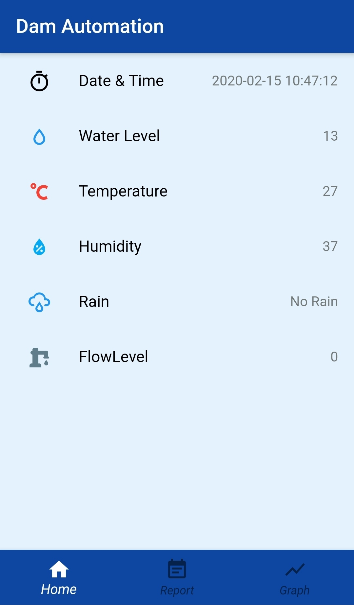
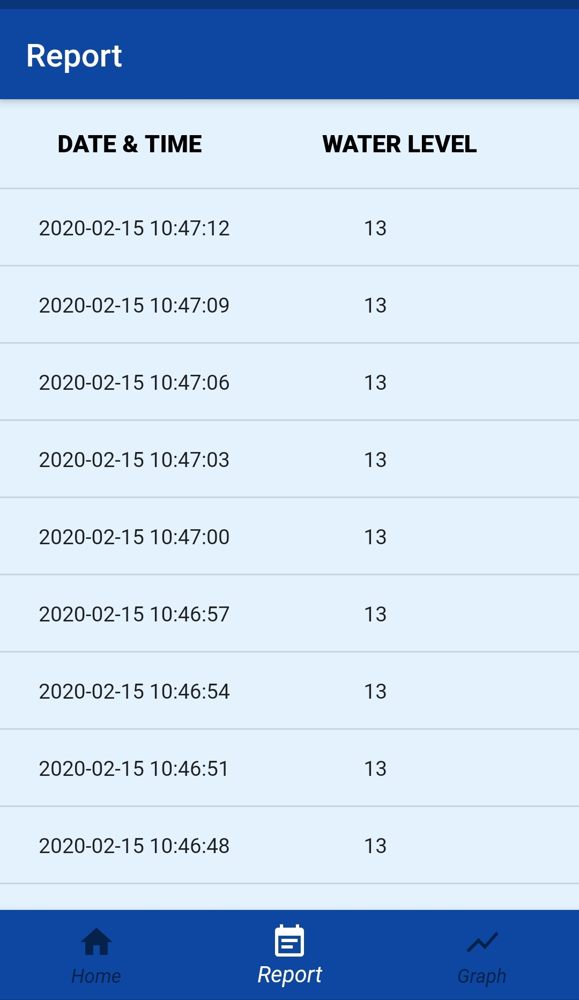
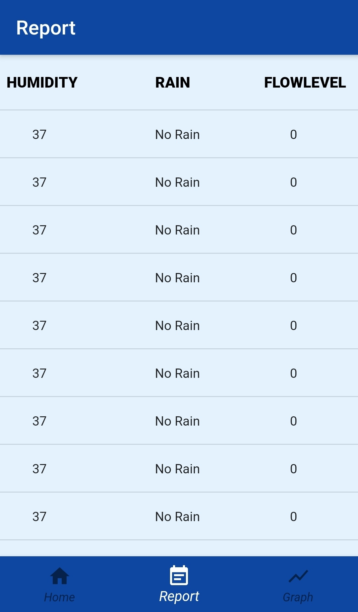
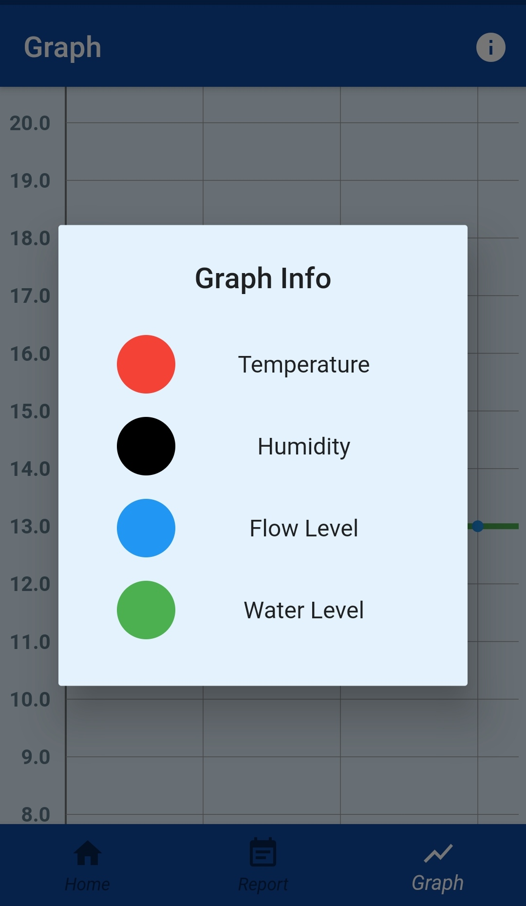

# DAM-AUTOMATION
A mobile application to monitor and display live readings(Temperature, Humidity, Waterlevel,etc,.) from DAM using Sensors. 

___________________________________________________________________________________________________________________________________________________________________________________

        &nbsp;&nbsp;&nbsp;&nbsp; &nbsp;&nbsp; &nbsp;&nbsp;&nbsp;&nbsp;&nbsp;&nbsp; &nbsp;&nbsp; &nbsp;&nbsp;          &nbsp;&nbsp;&nbsp;         

___________________________________________________________________________________________________________________________________________________________________________________

        &nbsp;&nbsp;&nbsp;&nbsp; &nbsp;&nbsp; &nbsp;&nbsp;&nbsp;&nbsp;&nbsp;&nbsp; &nbsp;&nbsp; &nbsp;&nbsp;          &nbsp;&nbsp;&nbsp;         
